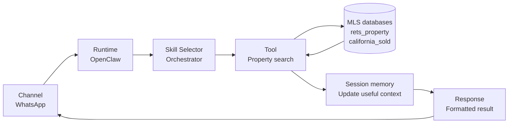
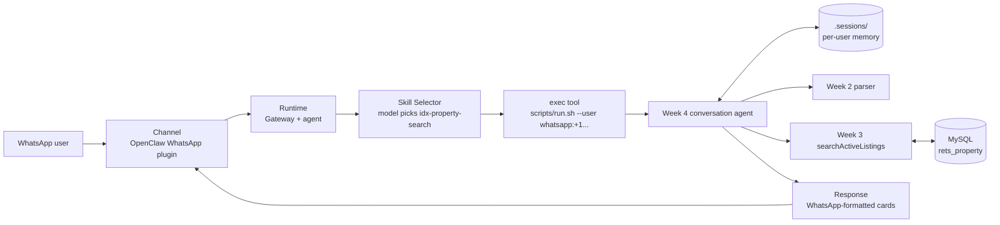

# IDX Exchange Agentic AI

## Completed work

- **Week 1:** OpenClaw architecture notes, workflow diagram, and a runnable
  asynchronous time-tool example.
- **Week 2:** A property-search parser that converts free text into
  structured MLS filters.
- **Week 3:** Parameterized MySQL queries against `rets_property`
  (`searchActiveListings`, with pagination) and `california_sold`
  (`getSoldComps`), returned as formatted property cards.
- **Week 4:** A multi-turn conversational agent with per-user session memory
  that asks for whatever is still missing (city, then budget, then type) and
  searches once it has enough.
- **OpenClaw + WhatsApp:** The `idx-property-search` skill in
  `skills/`, which OpenClaw runs once per incoming WhatsApp message.
- **Tests:** 41 automated tests, including live-database checks and a
  three-message conversation run through the skill's real entry point.

## Setup

Prerequisites:

- Node.js 20 or newer (uses the built-in `process.loadEnvFile`)
- MySQL with the `idx_exchange` database loaded (Week 0)
- A `.env` file in the project root (never committed):

```bash
MYSQL_HOST=127.0.0.1
MYSQL_PORT=3306
MYSQL_USER=idx_user
MYSQL_PASSWORD=your_secure_password
MYSQL_DATABASE=idx_exchange
```

Load the data (Week 0, step 5) if you haven't already:

```bash
mysql -u root -p -e "CREATE DATABASE idx_exchange CHARACTER SET utf8mb4;"
mysql -u root -p idx_exchange < db/rets_property.sql
mysql -u root -p idx_exchange < db/california_sold.sql
```

Install and verify:

```bash
npm install
npm test          # live-database tests skip themselves if MySQL is unreachable
npm run typecheck
```

Run each week's demonstration:

```bash
npm run week1
npm run week2
npm run week3     # real queries against MySQL
npm run week4     # the handbook conversation, printed as a WhatsApp-style chat
```

## Week 1 — OpenClaw architecture fundamentals

### The five building blocks

- **Skill:** A focused capability, such as parsing a property request.
- **Channel:** The interface through which a user sends a message, such as
  WhatsApp.
- **Session:** Per-user conversation state that preserves useful context
  between messages.
- **Tool:** A typed asynchronous function that performs one bounded operation.
- **Orchestrator:** The coordinator that selects the appropriate skill and
  returns its result through the originating channel.

### Query workflow



The required five stages are `Channel → Runtime → Skill Selector → Tool →
Response`; the database and memory nodes show where data lookup and context
updates happen inside that flow.

1. **Channel:** WhatsApp receives the user's request and passes it into the
   application.
2. **Runtime:** OpenClaw accepts the channel event and prepares it for agent
   handling.
3. **Skill Selector:** The orchestrator identifies the request's intent and
   chooses the property-search skill.
4. **Tool:** The selected skill calls a bounded function, which can query
   `rets_property` for active listings or `california_sold` for historical
   evidence.
5. **Response:** The result is formatted for the user and sent back through
   the same channel.

### Runnable time-tool example

`src/week1/time-example.ts` contains `getCurrentTime` and the small
`handleMessage` selector from the handbook. Running `npm run week1` prints an
object like:

```text
{ currentTime: '2026-09-30T00:00:00.000Z' }
```

The timestamp is generated at runtime, so its value changes on every run.

## Week 2 — Natural-language property search

### Skill contract

`parsePropertyQuery(query)` returns every supported field with either a
normalized value or `null`:

```ts
{
  city: "Irvine",
  maxPrice: 1500000,
  beds: 3,
  baths: null,
  sqft: null,
  type: "Condominium",
  pool: "True",
  view: null,
  maxHoa: null
}
```

The `propertySearchSkill` wrapper exposes the parser behind a simple skill
boundary. Week 3 can consume `result.filters` without knowing how the original
sentence was written.

### Filter-to-MLS mapping

| Parsed field | MLS column | Example |
| --- | --- | --- |
| `city` | `L_City` | `"Irvine"` |
| `maxPrice` | `L_SystemPrice` | `1500000` |
| `beds` | `L_Keyword2` | `3` |
| `baths` | `LM_Dec_3` | `2.5` |
| `sqft` | `LM_Int2_3` | `1800` |
| `type` | `L_Type_` | `"Condominium"` |
| `pool` | `PoolPrivateYN` | `"True"` |
| `view` | `ViewYN` | `"True"` |
| `maxHoa` | `AssociationFee` | `500` |

The parser supports:

- `k` and `m` price suffixes, decimals, commas, and plain numbers;
- `bed`, `bedroom`, `bd`, `bath`, `bathroom`, and `ba` forms;
- `sq ft`, `sqft`, and `square feet`;
- condo, townhome, single-family, multifamily, and land aliases;
- pool and view requirements, while not treating `no pool` as a positive
  requirement;
- separate property-price and HOA limits;
- cities after `in`, plus comma-delimited shorthand such as
  `3bd, irvine, under 1.5m`.

### Test process

The test suite starts with clean input, then adds shorthand, lowercase text,
different ordering, punctuation, aliases, missing fields, and negative amenity
wording. The difficult handbook example is included unchanged:

```text
need something w a pool, maybe 3bd, irvine, under 1.5m
```

Run `npm run week2` to print the parsed object for ten representative queries,
or `npm test` to validate all expected fields automatically.

Week 4 needed one parser change: the comma-segment city fallback now ignores
conversational replies such as `no preference`, `hello`, or `more`, so they are
never stored as a city.

## Week 3 — MLS database integration

Code: `src/week3/db.ts` (connection pool), `src/week3/listings.ts` (queries),
`src/week3/property-cards.ts` (formatting).

### Safe, parameterized queries

`buildActiveListingsQuery(filters, { page, limit })` starts from
`WHERE L_Status = 'Active'` and adds one `AND <column> ... ?` condition per filter
that is present, pushing the value onto `params` in the same order. User text
never appears in the SQL string — a test passes
`Irvine"; DROP TABLE rets_property; --` as a city and asserts it only shows up
in `params`. The query is kept separate from execution so it can be unit
tested without a database.

| Filter | Condition |
| --- | --- |
| `city` | `L_City = ?` |
| `maxPrice` | `L_SystemPrice <= ?` |
| `beds`, `baths`, `sqft` | `L_Keyword2 >= ?`, `LM_Dec_3 >= ?`, `LM_Int2_3 >= ?` |
| `type` | `L_Type_ = ?` |
| `pool`, `view` | `PoolPrivateYN IN (?, ?)`, `ViewYN IN (?, ?)` |
| `maxHoa` | `COALESCE(AssociationFee, 0) <= ?` |

Decisions worth knowing:

- **Beds, baths, and sqft are minimums.** "3 bedrooms" means "at least 3",
  matching Week 4's "at least 3 beds" phrasing.
- **Amenity flags.** The handbook says to compare with `"True"`, but this data
  dump stores `"1"` or an empty string. The query accepts both.
- **Missing HOA counts as $0**, so homes with no association are not excluded
  by an HOA limit.
- **Pagination:** `ORDER BY L_SystemPrice ASC, id ASC LIMIT ? OFFSET ?` with
  `offset = (page - 1) * limit`. The `id` tie-breaker keeps pages stable when
  two listings share a price.
- **Row cap:** page size is capped at 50, following the Week 11 rule against
  bulk-exporting licensed MLS data.

### Sold comps

`getSoldComps(city, months, limit)` returns recent `california_sold` sales for
a city, newest first, with price per square foot computed as
`ClosePrice / NULLIF(LivingArea, 0)`. `CloseDate` is stored as `YYYY-MM-DD`
text, so it is compared as a string. A few sales are dated in the future (up
to 2072), so results also require `CloseDate <= today`.

### Property cards

```text
*2617 Sierra Street, Los Angeles*
$949,900 | 5bd/5ba | 3,131 sqft
Single family | 16 photos | 247 days on market
View
MLS# 1118282711
```

Photo count is the length of the `L_Photos` JSON array. `*text*` is WhatsApp's
bold syntax, so the same card works on the channel unchanged.

### Deliverable checks (`npm run week3`, `test/week3.test.ts`)

| Handbook check | Result on the local data |
| --- | --- |
| City only (`Los Angeles`) | 7 listings, all Los Angeles, cheapest first |
| Every field filled in (Indio, ≤$750K, 4+bd, 3+ba, 2,000+ sqft, single family, pool, view, HOA ≤$500) | 1 matching listing |
| No filters | The 10 cheapest active listings |
| Page 1 vs page 2 | No overlapping listing IDs |
| `getSoldComps("Los Angeles", 12)` | Recent Los Angeles sales, none future-dated |

The local `rets_property` dump is a 100-listing sample; `california_sold` has
74,000 sales from March to August 2026.

## Week 4 — Conversational property search agent

Code: `src/week4/session.ts` (session memory), `src/week4/conversation.ts`
(the agent).

### Session memory

`getSession`, `updateSession`, and `clearSession` follow the handbook. Each
user's `UserSession` holds their filters, whether the type question has been
asked, the current page, `lastResults`, and `conversationStep`. Sessions are
keyed by user ID, so one user's budget never leaks into another's search.

The storage behind those functions can be swapped:

- `MemorySessionStore` is the handbook's in-memory `Map`, used by the demo and
  tests.
- `FileSessionStore` writes one JSON file per user to `.sessions/`. OpenClaw
  starts a new process for every WhatsApp message, so an in-memory `Map` would
  forget the conversation between messages. File names are SHA-256 hashes of
  the user ID, so phone numbers are never written to disk as file names.
  `.sessions/` is git-ignored.

Sessions idle for more than 2 hours start fresh, so yesterday's budget doesn't
carry into a new search.

### How the agent decides what to say

For every message, `handleConversationMessage(userId, message)`:

1. Starts over on `reset`, `start over`, `new search`, or `clear`.
2. Fetches the next page of the same search on `more` or `next`.
3. Otherwise runs the Week 2 parser and merges every field it found into the
   session. New answers overwrite old ones, so "actually under $1.5M" refines
   the budget.
4. Asks the first missing question: city, then budget, then "condo, townhome,
   or single family?". The type question is only asked once; any answer
   (including "no preference") moves on.
5. Once nothing is missing, runs the Week 3 search (5 results per page, the
   WhatsApp limit), saves `lastResults`, and replies with property cards. If
   nothing matches, it suggests raising the budget or removing a filter.

### The handbook conversation (`npm run week4`)

```text
User:  Find homes in Irvine
Agent: What is your budget?
User:  Under $1.2M
Agent: Any preferences — condo, townhome, or single family?
User:  Single family with at least 3 beds
Agent: I couldn't find any active listings for single family in Irvine,
       under $1,200,000, 3+ beds. Try a higher budget or fewer requirements,
       or say "reset" to start over.
```

The agent never re-asks for the city, and the final search uses all four
accumulated filters. Zero results is the correct answer for this sample: its
only Irvine listings are a $1.79M condo and a $2.99M house. The demo then runs
the same three messages for Los Angeles, which returns two homes, and shows a
follow-up ("Actually make it under $3.5M") refining the Irvine search to the
$2.99M house before `reset` clears it.

The automated test runs the exact handbook conversation with a stubbed search
and asserts the questions asked, the final filters
(`{ city: "Irvine", maxPrice: 1200000, beds: 3, type: "SingleFamilyResidence" }`),
and that cards include address, price, beds/baths, and photo count.

## How this runs in OpenClaw and WhatsApp



Mapped onto the Week 1 building blocks:

| Building block | In this project |
| --- | --- |
| Channel | OpenClaw's WhatsApp plugin (`plugins.entries.whatsapp`) |
| Runtime | The OpenClaw gateway and agent that receive each WhatsApp message |
| Skill | `skills/idx-property-search/SKILL.md` |
| Tool | `searchActiveListings` / `getSoldComps`, called through `scripts/run.sh` |
| Session | `FileSessionStore`, keyed by `whatsapp:<sender phone number>` |
| Orchestrator | For now, the OpenClaw model choosing this skill (Week 9 replaces it with `orchestrate`) |

### The skill

`skills/idx-property-search/SKILL.md` tells the OpenClaw agent to:

- use the skill for any request to find or browse homes, and for replies to
  its own questions;
- run `{baseDir}/scripts/run.sh --user 'whatsapp:<E.164 number>'`, passing the
  user's message on stdin inside a quoted heredoc (`<<'IDX_MSG'`). The quoted
  heredoc means the shell never interprets the user's text, and the CLI also
  rejects user IDs containing anything other than letters, digits, and
  `+ : . @ - _`;
- send the output back exactly as printed, without inventing listings.

`scripts/run.sh` runs `src/openclaw/cli.ts`, which loads the file session
store, calls `handleConversationMessage`, and prints the reply. On any error it
logs details to stderr and prints a short apology on stdout, so a WhatsApp
user never sees a stack trace.

You can call the entry point exactly as OpenClaw does:

```bash
skills/idx-property-search/scripts/run.sh --user 'whatsapp:+15550001234' <<'IDX_MSG'
Find homes in Los Angeles
IDX_MSG
# -> What is your budget?
```

### Registering the skill (done on this machine)

```bash
openclaw config set skills.load.extraDirs '["/Users/ogheneatoma/IDX-Exchange-Agentic-AI/skills"]' --strict-json
openclaw skills info idx-property-search   # -> ✓ Ready, Visible to model: yes
```

This loads the skill straight from the repository, so edits take effect
without copying files. Undo it with
`openclaw config unset skills.load.extraDirs`.

### Remaining steps for a live WhatsApp demo

These need you, not code:

1. **Restore model credits.** A test turn
   (`openclaw agent --local --to +15550001234 --message "Find homes in Los Angeles"`)
   loaded the skill but stopped at the model call: the configured OpenAI key
   has no credits (`insufficient_quota`). Top up the key or switch providers
   with `openclaw configure`.
2. **Link WhatsApp.** Run `openclaw channels login --channel whatsapp` and scan
   the QR code from WhatsApp → Settings → Linked Devices on your phone.
3. **Allow your number.** Unknown senders need pairing approval by default.
   For testing, set `channels.whatsapp.dmPolicy` to `allowlist` and add your
   number to `channels.whatsapp.allowFrom`.
4. **Start the gateway** (`openclaw gateway`), then send the three handbook
   messages from your phone, for example using Los Angeles so the sample data
   has matches.

## Project structure

```text
src/
  env.ts                          loads .env
  week1/time-example.ts
  week2/property-query-parser.ts
  week2/demo.ts
  week3/db.ts                     mysql2 connection pool
  week3/listings.ts               searchActiveListings, getSoldComps
  week3/property-cards.ts         card / WhatsApp formatting
  week3/demo.ts
  week4/session.ts                getSession, updateSession, clearSession
  week4/conversation.ts           multi-turn agent
  week4/demo.ts
  openclaw/cli.ts                 entry point the skill runs
skills/
  idx-property-search/SKILL.md
  idx-property-search/scripts/run.sh
test/
  week1.test.ts  week2.test.ts  week3.test.ts  week4.test.ts
db/
  rets_property.sql  california_sold.sql  rets_openhouse.sql
```

## Implementation notes

1. The database field mappings were extracted first.
2. Week 1's example was kept deliberately small so the tool/selector boundary
   remains visible.
3. Week 2 parsing was split into helpers for money, city, property type, and
   amenities instead of one oversized regular expression.
4. Week 3 started by checking the real columns and values in MySQL, which is
   how the `"1"` amenity flags and future-dated sales were found.
5. Week 4's conversation logic takes the search function as a parameter, so
   tests can check the exact filters it would query without a database.
6. Tests were added before accepting each edge-case adjustment. TypeScript
   strict mode and dependency auditing are part of verification.

Secrets belong in `.env`; the repository's `.gitignore` excludes that file,
`.sessions/`, dependencies, build output, coverage, and local virtual
environments.
